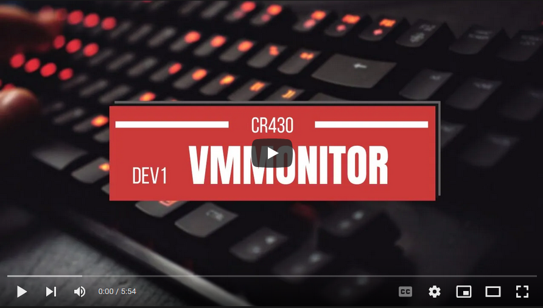

<div id="top"></div>

<!-- PROJECT LOGO -->
<br />
<div align="center">
  <a href="https://github.com/mecanass/VmMonitorModule">
    
  </a>

<h3 align="center">VmMonitor</h3>

  <p align="center">
    Un module PowerShell pour surveiller la performance des machines virtuelles dans le cloud Azure
    <br />
    <a href="#demo">Regarder une Demo :clapper: </a>
    ·
    <a href="https://github.com/mecanass/VmMonitorModule/issues/new/choose">Signaler un Bug :bug: </a> 
  </p>
</div>

<!-- ABOUT THE PROJECT -->
## À propos du projet

Dans le cadre d'un travail pratique du cours CR430, on devait créer un module powershell. Celui-ci sert à monitorer les machines virtuelles dans le cloud Azure. Cette version n'est pas complète et le projet est en construction.

<p align="right">(<a href="#top">back to top</a>)</p>

### Technologies utilisées

* [PowerShell](https://docs.microsoft.com/en-us/powershell/) 

<p align="right">(<a href="#top">back to top</a>)</p>

### Prérequis

Il faut avoir le module Azure PowerShell installé.

## Utilisation
Pour utiliser les fonctionnalités du module, il faut d'abord l'importer en utilisant la commande suivante dans le répertoire qui contient le module:
   ```powershell
   Import-Module ./VmMonitor.psm1
   ```
Après l'importation on peut appeler ces commandes:

  - Afficher le menu interactif :  
   ```powershell
   Start-Menu
   ```
  - Afficher l'utilisation CPU d'une VM :
   ```powershell
   Show-CPUsageVmAz
   ```
  - Demarrer les VM eteintes :
   ```powershell
   Start-VmAz
   ```
  - Installer l'extension AntiMalware pour les VM Windows :
   ```powershell
   CheckAntMalWinAzVm
   ```

<p align="right">(<a href="#top">back to top</a>)</p>
<div id="demo"></div>

## Démonstration

voici la video de démonstration du module:

[](https://www.youtube.com/watch?v=6UljG_mlx0c)

Sinon, [cliquez ici](./media/demo.mov) pour accèder à la video de la démonstration.
<p align="right">(<a href="#top">back to top</a>)</p>